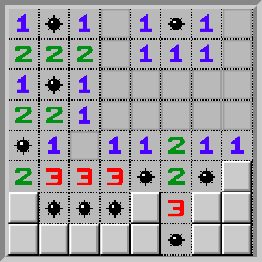

# Minefield using Flexbox

### URL of the project :
https://laetitiagullo.github.io/flexbox-minefield/

### Date of realization :
January 2021

### Status :
Completed project

### Type of project :
Exercise

### Context :
Project carried out as part of the "Junior web developer" training [@ BeCode](https://becode.org/)

### Languages :
* HTML
* CSS

### Learning objectives :
1. Increasing knowledge of HTML
2. Increasing knowledge of CSS
3. Learning the basics of flexbox

### Instructions link :
[Click here](https://github.com/becodeorg/LIE-Jepsen-4.27/tree/master/01-the-field/04-html-css/02-css/01-flexbox)

### Images of the project :

